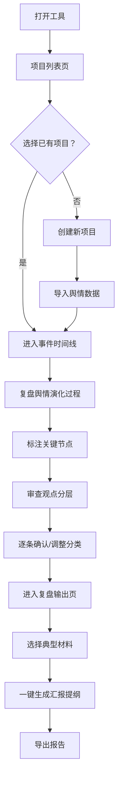

## 1. 产品概述

面向大型文旅集团舆情分析师的桌面端深度复盘研判工具，聚焦黄金周、音乐节、灯会等大型活动周期后的舆情复盘场景。解决分析师在海量舆情数据中难以还原事件演化全貌、无法区分不同角色声音、复盘材料整理耗时等痛点。

- 核心目标：将分散的舆情数据按时间线还原事件全貌，分层展示不同角色观点，一键生成复盘汇报材料
- 目标用户：文旅集团舆情分析师、品牌公关团队、管理层决策者
- 核心价值：从"实时值班式"监测转向"深度复盘式"研判，提升复盘效率和洞察深度

## 2. 核心功能

### 2.1 用户角色

| 角色 | 说明 | 核心权限 |
|------|------|----------|
| 舆情分析师 | 主要使用者 | 创建/编辑项目、导入数据、标注节点、调整分类、生成报告 |
| 管理层 | 审阅者 | 查看项目、导出报告 |

### 2.2 功能模块

1. **项目列表页**：项目管理入口，创建/导入景区或活动周期项目，查看项目概览和状态
2. **事件时间线页**：按时间线展示舆情演化全貌，标注爆点/降温点/二次发酵点等关键节点
3. **观点分层面板**（嵌入时间线页）：按游客、当地居民、媒体、自媒体达人、旅行社等角色分层展示声音
4. **复盘输出页**：选择典型帖子、传播截图、处置动作和结论，一键整理成汇报提纲

### 2.3 页面详情

| 页面名称 | 模块名称 | 功能描述 |
|----------|----------|----------|
| 项目列表页 | 项目卡片列表 | 展示所有复盘项目，含景区名称、活动周期、舆情热度、分析状态 |
| 项目列表页 | 新建项目弹窗 | 输入景区/活动名称、时间范围，上传或粘贴舆情数据 |
| 项目列表页 | 快速筛选栏 | 按状态（进行中/已完成）、时间、热度排序筛选 |
| 事件时间线页 | 时间线主体 | 纵向时间线展示舆情事件从首发→扩散→媒体转述→官方回应的完整过程 |
| 事件时间线页 | 关键节点标注 | 在时间线上标注：爆点（红色🔥）、降温点（蓝色❄️）、二次发酵点（橙色🔄） |
| 事件时间线页 | 事件详情卡片 | 点击节点展示帖子原文、传播量、情绪倾向、关联角色 |
| 事件时间线页 | 观点分层面板 | 侧栏按角色分组展示声音，支持逐条确认/调整分类 |
| 事件时间线页 | 角色筛选器 | 勾选/取消角色类型，聚焦特定群体观点 |
| 事件时间线页 | 情绪趋势图 | 时间线上方展示整体情绪走势曲线 |
| 复盘输出页 | 材料选择区 | 从时间线中勾选典型帖子、传播截图、处置动作 |
| 复盘输出页 | 报告提纲预览 | 按模板自动生成：事件概述→演化过程→各方观点→处置评估→改进建议 |
| 复盘输出页 | 导出功能 | 支持导出为文本/打印格式 |

## 3. 核心流程

分析师打开工具 → 在项目列表创建/选择项目 → 进入事件时间线页面 → 沿时间线复盘舆情演化过程，标注关键节点 → 在观点分层面板中审查各角色声音，调整分类 → 切换到复盘输出页 → 选择典型材料和结论 → 一键生成汇报提纲 → 导出报告

## 4. 用户界面设计

### 4.1 设计风格

- **整体风格**：深色专业工具风格（Dark Mode优先），参考安全运营中心/SOC大屏的设计语言，突出数据密度和专业感
- **主色调**：深灰黑底（#0D1117）+ 暗蓝灰面板（#161B22）+ 亮蓝强调色（#58A6FF）
- **辅助色**：爆点红（#F85149）、降温蓝（#79C0FF）、发酵橙（#D29922）、成功绿（#3FB950）
- **字体**：标题用 Noto Sans SC Bold，正文用 Noto Sans SC Regular，数据/标签用 JetBrains Mono
- **布局**：三栏式桌面布局，左侧项目导航，中间主工作区，右侧详情面板
- **按钮风格**：圆角矩形（8px），扁平化设计，hover时微发光效果
- **图标**：Lucide图标库，线条风格，16-20px
- **动画**：节点展开/收起有缓动动画，情绪曲线绘制有渐进动画，面板切换有滑动过渡

### 4.2 页面设计概览

| 页面名称 | 模块名称 | UI元素 |
|----------|----------|--------|
| 项目列表页 | 项目卡片 | 深色卡片，左侧色条表示状态，右上角热度徽章，底部时间范围和标签 |
| 项目列表页 | 筛选栏 | 顶部横向排列，胶囊形筛选按钮，激活态高亮 |
| 事件时间线页 | 时间线 | 居中纵向线，左右交替排列事件卡片，节点处有图标和类型标签 |
| 事件时间线页 | 关键节点 | 爆点（红色脉冲动画）、降温点（蓝色雪花图标）、发酵点（橙色旋转图标） |
| 事件时间线页 | 情绪曲线 | 顶部横向区域图，红色负面/绿色正面填充，关键节点标注竖线 |
| 事件时间线页 | 观点面板 | 右侧抽屉式面板，角色图标+名称+计数，展开显示帖子列表 |
| 复盘输出页 | 材料列表 | 可勾选的卡片网格，已选项高亮边框 |
| 复盘输出页 | 报告预览 | 居中A4纸样式预览区，左侧大纲导航，右侧可拖拽调整顺序 |

### 4.3 响应式策略

- 桌面端优先设计（最低1280px宽度），三栏布局
- 1280px以下：右侧面板折叠为抽屉
- 不做移动端适配，这是专业桌面工具

### 4.4 3D场景指引

不适用
