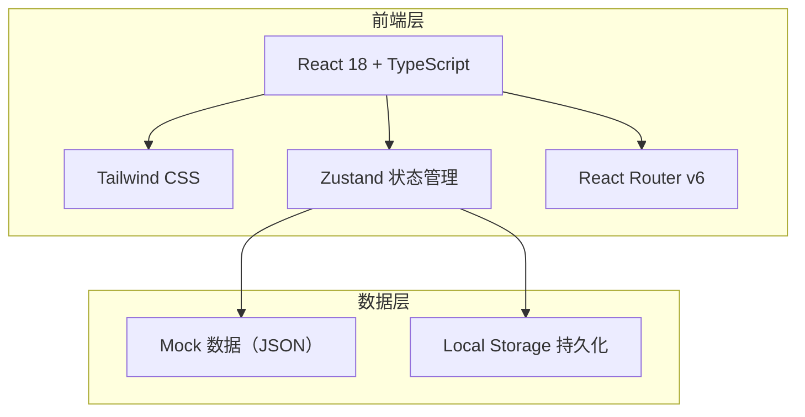
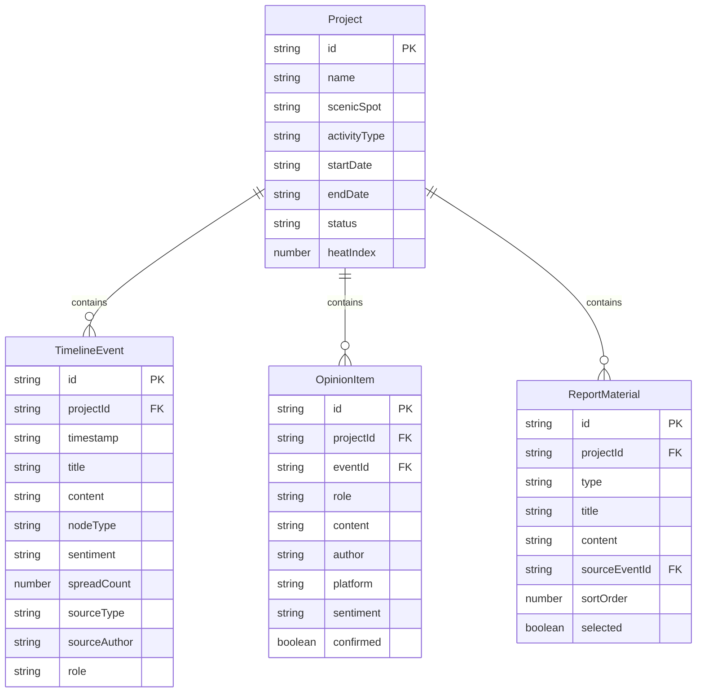

## 1. 架构设计

纯前端架构，不依赖后端服务。数据通过Mock JSON提供演示数据，用户操作通过Zustand状态管理 + Local Storage实现持久化。

## 2. 技术说明

- **前端框架**：React 18 + TypeScript + Vite
- **样式方案**：Tailwind CSS 3
- **状态管理**：Zustand
- **路由**：React Router DOM v6
- **图表**：Recharts（情绪趋势图）
- **图标**：lucide-react
- **数据方案**：Mock JSON + Local Storage 持久化
- **后端**：无（纯前端应用）
- **数据库**：无（使用 Local Storage）

## 3. 路由定义

| 路由 | 用途 |
|------|------|
| `/` | 项目列表页，展示所有复盘项目 |
| `/project/:id` | 事件时间线页，含观点分层面板 |
| `/project/:id/report` | 复盘输出页，材料选择与报告生成 |

## 4. API定义

不适用（纯前端，无后端API）

## 5. 服务端架构图

不适用（纯前端应用）

## 6. 数据模型

### 6.1 数据模型定义

### 6.2 数据定义

项目状态枚举：
- `analyzing` - 分析中
- `completed` - 已完成

节点类型枚举：
- `origin` - 首发
- `spread` - 扩散
- `media_relay` - 媒体转述
- `official_response` - 官方回应
- `breakout` - 爆点
- `cooldown` - 降温点
- `re_ferment` - 二次发酵点

角色枚举：
- `tourist` - 游客
- `local_resident` - 当地居民
- `media` - 媒体
- `influencer` - 自媒体达人
- `travel_agency` - 旅行社

情绪枚举：
- `positive` - 正面
- `neutral` - 中性
- `negative` - 负面

材料类型枚举：
- `typical_post` - 典型帖子
- `spread_screenshot` - 传播截图
- `action_taken` - 处置动作
- `conclusion` - 结论
